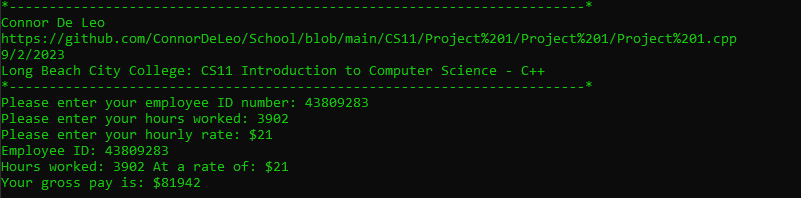

# CS11 - Project 1
## Task
Write a simple C++ program that displays a title, "Employee Salary Records." Insert comments in the program to document the program internally.
## Example Output
```
Author's Name, e.g., Tahir Aziz

Program Name, e.g., Aziz_Assign1_Salary.cpp

Date, e.g., Feb. 16th, 2020

College Name, e.g., Long Beach City College (LBCC)

===============================================================

Employee ID: 12345

Hours Worked: 40

Rate per Hour: 20

Gross Salary: $800 / week
```
## Code
### Project 1.cpp
https://github.com/ConnorDeLeo/School/blob/main/CS11/Project%201/Project%201/Project%201.cpp
```cpp
#include <iostream>

using namespace std;

int main()
{
	// Input vars
    int eid = 0;
    double hours = 0;
    double rate = 0;

    // Output vars
    double gross = 0;

    // Header
    cout << "*------------------------------------------------------------------------*" << endl;
    cout << "Connor De Leo" << endl;
    cout << "https://github.com/ConnorDeLeo/School/blob/main/CS11/Project%201/Project%201/Project%201.cpp" << endl;
    cout << "9/2/2023" << endl;
    cout << "Long Beach City College: CS11 Introduction to Computer Science - C++" << endl;
    cout << "*------------------------------------------------------------------------*" << endl;

    // Get input
    cout << "Please enter your employee ID number: ";
    cin >> eid;
    cout << "Please enter your hours worked: ";
    cin >> hours;
    cout << "Please enter your hourly rate: $";
    cin >> rate;

    // Math
    gross = hours * rate;

    // Output
    cout << "Employee ID: " << eid << endl;
    cout << "Hours worked: " << hours << " At a rate of: $" << rate << endl;
    cout << "Your gross pay is: $" << gross << endl;

    return 0;
}
```
## Ouput
