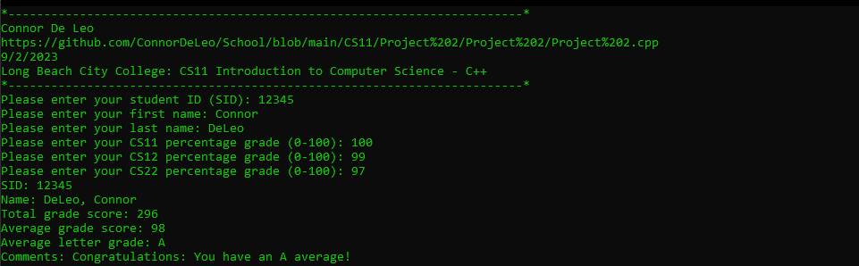

# CS11 - Project 2
## Task
Write a C++ program that accepts a student ID, first name, last name, and student’s score for the classes: CS11, CS12, and CS22. Calculate the student’s total and average scores. Also, calculate the letter grade for the student by following the criteria given below:

A greater than or equal to 90

B less than 90 but greater than or equal to 80

C less than 80 but greater than or equal to 70

D less than 70 but greater than or equal to 60

F less than 60

Display the above grades appropriate for the student. If the student has an “A” grade than display a congratulatory message. If the student gets an “F” grade than display a warning message.

## Example Output
```
===============================================================

Student Grading System (SGS)

Long Beach City College

Author: Your Name

Feb. 27, 2020

===============================================================

ID: 12345

First Name: Your First Name

Last Name: Your Last Name

Total: 270

Average: 90.00%

Grade: A

Comments: Congratulations on your achievements!
```

## Code
### Project 2.cpp
https://github.com/ConnorDeLeo/School/blob/main/CS11/Project%202/Project%202/Project%202.cpp

```cpp
#include <iostream>
#include <string>

using namespace std;

string getComment(char grade)
{
	if (grade == 'F')
	{
		return "Warning: Severe danger of failing!";
	}
	else if (grade == 'A')
	{
		return "Congratulations: You have an A average!";
	}
	else if (grade == 'N')
	{
		return "Warning: Typo or cheating has occured!";
	}
	else
	{
		return "No comment.";
	}
}

char getGrade(float avg)
{
	if (avg < 60.0f)
	{
		return 'F';
	}
	else if ((avg >= 60.0f) && (avg < 70.0f))
	{
		return 'D';
	}
	else if ((avg >= 70.0f) && (avg < 80.0f))
	{
		return 'C';
	}
	else if ((avg >= 80.0f) && (avg < 90.0f))
	{
		return 'B';
	}
	else if ((avg >= 90.0f) && (avg <= 100.0f))
	{
		return 'A';
	}
	else
	{
		return 'N';
	}
}

int main()
{
	// var inits
	int sid = 0;
	string first = "";
	string last = "";

	int cs11 = 0;
	int cs12 = 0;
	int cs22 = 0;

	int total = 0;
	float avg = 0.0f;

	char grade = 'A';
	string comment = "";

	// header
	cout << "*------------------------------------------------------------------------*" << endl;
	cout << "Connor De Leo" << endl;
	cout << "https://github.com/ConnorDeLeo/School/blob/main/CS11/Project%202/Project%202/Project%202.cpp" << endl;
	cout << "9/2/2023" << endl;
	cout << "Long Beach City College: CS11 Introduction to Computer Science - C++" << endl;
	cout << "*------------------------------------------------------------------------*" << endl;

	// get input
	cout << "Please enter your student ID (SID): ";
	cin >> sid;
	cout << "Please enter your first name: ";
	cin >> first;
	cout << "Please enter your last name: ";
	cin >> last;
	cout << "Please enter your CS11 percentage grade (0-100): ";
	cin >> cs11;
	cout << "Please enter your CS12 percentage grade (0-100): ";
	cin >> cs12;
	cout << "Please enter your CS22 percentage grade (0-100): ";
	cin >> cs22;

	// calcs
	total = cs11 + cs12 + cs22;

	avg = total / 3;

	grade = getGrade(avg);

	comment = getComment(grade);

	// output
	cout << "SID: " << sid << endl;
	cout << "Name: " << last << ", " << first << endl;
	cout << "Total grade score: " << total << endl;
	cout << "Average grade score: " << avg << endl;
	cout << "Average letter grade: " << grade << endl;
	cout << "Comments: " << comment;
}
```

## Output
