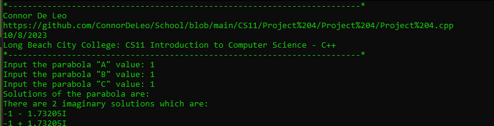

# CS11 - Project 4
## Task
Create a program that will read the coefficients of a quadratic equation and, if the lead coefficients are non-zero, calculate and report the solutions.

## Example Output


## Code
### Project 4.cpp
https://github.com/ConnorDeLeo/School/blob/main/CS11/Project%204/Project%204/Project%204.cpp

```cpp
#include <iostream>
#include <string>

using namespace std;

int main()
{
	// var inits
	int a;
	int b;
	int c;

	double discrim;
	double numerator1;
	double numerator2;
	double denominator;

	bool imag = false;
	double imagDiscrim;

	double x1;
	double x2;

	// header
	cout << "*------------------------------------------------------------------------*" << endl;
	cout << "Connor De Leo" << endl;
	cout << "https://github.com/ConnorDeLeo/School/blob/main/CS11/Project%204/Project%204/Project%204.cpp" << endl;
	cout << "10/8/2023" << endl;
	cout << "Long Beach City College: CS11 Introduction to Computer Science - C++" << endl;
	cout << "*------------------------------------------------------------------------*" << endl;

	// input
	cout << "Input the parabola \"A\" value: ";
	cin >> a;
	cout << "Input the parabola \"B\" value: ";
	cin >> b;
	cout << "Input the parabola \"C\" value: ";
	cin >> c;

	// calcs
	if (a != 0)
	{
		discrim = (pow(b, 2) - (4 * a * c));

		denominator = pow(a, 2);

		if (discrim >= 0)
		{
			numerator1 = ((-1 * b) + sqrt(discrim));
			numerator2 = ((-1 * b) - sqrt(discrim));

			x1 = numerator1 / denominator;
			x2 = numerator2 / denominator;
		}
		else
		{
			imagDiscrim = sqrt((-1 * discrim));
			imag = true;
			b *= -1;
		}
	}

	// output
	if (a != 0)
	{
		cout << "Solutions of the parabola are: " << endl;

		if (imag == false)
		{
			if (x1 != x2)
			{
				cout << "There are 2 real solutions which are: " << endl;
				cout << x1 << endl;
				cout << x2;
			}
			else
			{
				cout << "There is 1 real solution which is: " << endl;
				cout << x1;
			}
		}
		else
		{
			if ((b - imagDiscrim) != (b + imagDiscrim))
			{
				cout << "There are 2 imaginary solutions which are: " << endl;
				cout << b << " - " << imagDiscrim << "I" << endl;
				cout << b << " + " << imagDiscrim << "I";
			}
			else
			{
				cout << "There is 1 imaginary solution which is: " << endl;
				cout << b << " + " << imagDiscrim << "I";
			}
		}
	}
	else
	{
		cout << "There are no real or imaginary solutions to the parabola.";
	}
}
```

## Outputs



