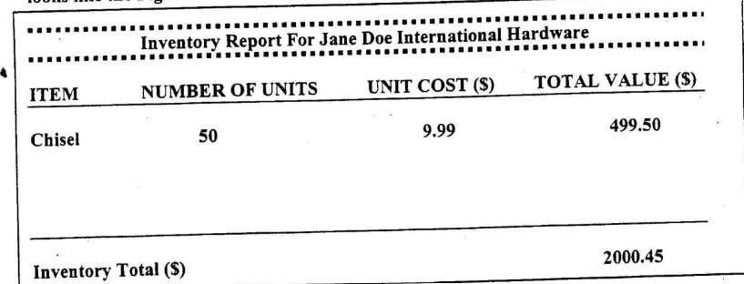
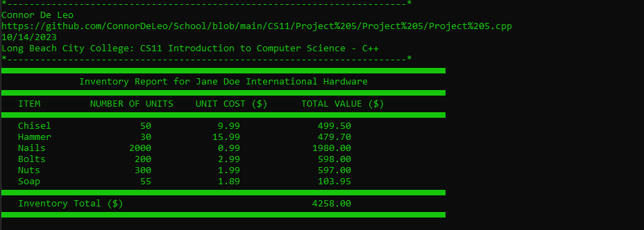

# CS11 - Project 5
## Task
Write a C++ program to read data from an ASCII file which has the inventory data for a store. Use only Windows Notepad to write the inventory file with a part name (one word only), the number of units in inventory (integer), and the price of each item (floating point data).

Example `inventory.txt`:
```
Chisel 50 9.99 Hammer 30 15.99 Nails 2000 0.99 Bolts 200 2.99 Nuts 300 1.99 Soap 55 1.89
```

## Example Output


## Code
### Project 5.cpp
https://github.com/ConnorDeLeo/School/blob/main/CS11/Project%205/Project%205/Project%205.cpp

```cpp
#include <iostream>
#include <fstream>
#include <string>
#include <iomanip>
#include <cmath>

using namespace std;

struct item
{
	string product; double quantity; double cost;
};

int main()
{
	char ch = 254;
	char ch1 = 196;

	cout << "*------------------------------------------------------------------------*" << endl;
	cout << "Connor De Leo" << endl;
	cout << "https://github.com/ConnorDeLeo/School/blob/main/CS11/Project%205/Project%205/Project%205.cpp" << endl;
	cout << "10/14/2023" << endl;
	cout << "Long Beach City College: CS11 Introduction to Computer Science - C++" << endl;
	cout << "*------------------------------------------------------------------------*" << endl;

	item items[6];

	ifstream inputfile("inventory.txt");
	for (int i = 0; i < 6; i++)
	{
		inputfile >> items[i].product >> items[i].quantity >> items[i].cost;
	}

	inputfile.close();

	double sum = 0.0;

	for (int j = 0; j < 80; j++)
	{
		cout << ch;
	}
	cout << endl;

	cout << setw(14) << " " << "Inventory Report for Jane Doe International Hardware" << endl;

	for (int j = 0; j < 80; j++)
	{
		cout << ch;
	}
	cout << endl;

	cout << "   ITEM         NUMBER OF UNITS    UNIT COST ($)      TOTAL VALUE ($)" << endl;

	for (int j = 0; j < 80; j++)
	{
		cout << ch;
	}
	cout << endl;

	for (int i = 0; i < 6; i++)
	{
		double total = items[i].quantity * items[i].cost;
		sum += total;

		cout << "   " << left << setw(14) << items[i].product << right << setw(10) << setprecision(10) << items[i].quantity << setw(16) << items[i].cost << fixed << setprecision(2) << setw(20) << items[i].quantity * items[i].cost << defaultfloat << endl;
	}

	for (int j = 0; j < 80; j++)
	{
		cout << ch;
	}
	cout << endl;

	cout << setw(56) << left << "   Inventory Total ($)" << fixed << setprecision(2) << round(sum) << endl;

	for (int j = 0; j < 80; j++)
	{
		cout << ch;
	}
	cout << endl;

	ofstream outputfile("Inventory_Receipt.txt");

	outputfile << "*------------------------------------------------------------------------*" << endl;
	outputfile << "Connor De Leo" << endl;
	outputfile << "https://github.com/ConnorDeLeo/School/blob/main/CS11/Project%205/Project%205/Project%205.cpp" << endl;
	outputfile << "10/14/2023" << endl;
	outputfile << "Long Beach City College: CS11 Introduction to Computer Science - C++" << endl;
	outputfile << "*------------------------------------------------------------------------*" << endl;

	for (int j = 0; j < 80; j++)
	{
		outputfile << ch;
	}
	outputfile << endl;

	outputfile << setw(14) << " " << "Inventory Report for Jane Doe International Hardware" << endl;

	for (int j = 0; j < 80; j++)
	{
		outputfile << ch;
	}
	outputfile << endl;

	outputfile << "   ITEM         NUMBER OF UNITS    UNIT COST ($)      TOTAL VALUE ($)" << endl;

	for (int j = 0; j < 80; j++) {
		outputfile << "-";
	}
	outputfile << endl;

	for (int i = 0; i < 6; i++) {

		double total = items[i].quantity * items[i].cost;
		sum += total;

		outputfile << "   " << left << setw(14) << items[i].product << right << setw(10) << setprecision(10) << items[i].quantity << setw(16) << items[i].cost << fixed << setprecision(2) << setw(20) << items[i].quantity * items[i].cost << defaultfloat << endl;
	}

	for (int j = 0; j < 80; j++) {
		outputfile << "-";
	}
	outputfile << endl;

	outputfile << setw(56) << left << "   Inventory Total ($)" << setprecision(2) << fixed << round(sum) << endl;

	for (int j = 0; j < 80; j++) {
		outputfile << "=";
	}
	outputfile << endl;

	outputfile.close();
	return 0;
}
```

## Input


## Output
